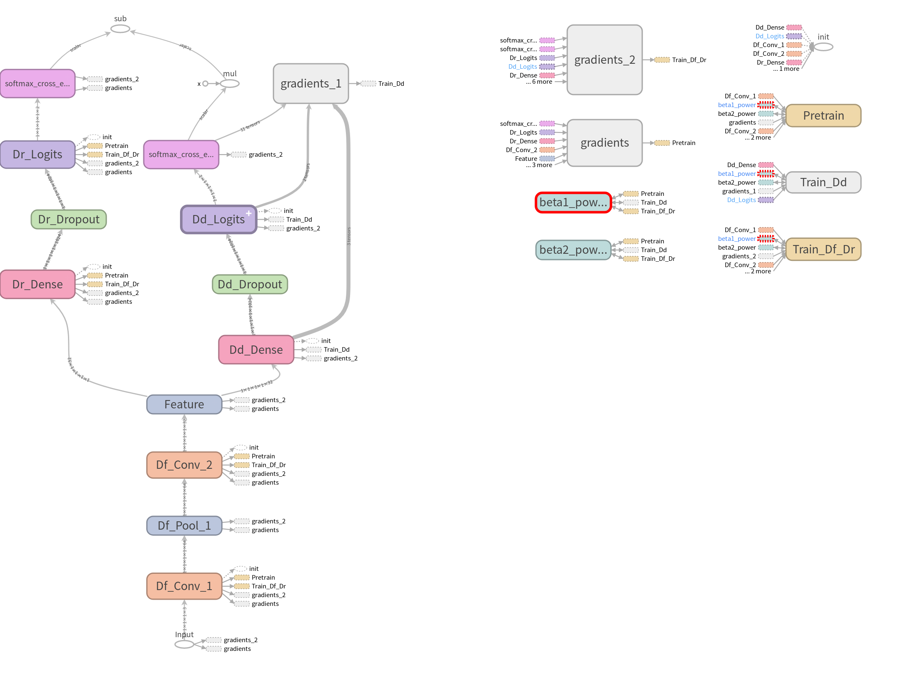

Wed May 23 2018
===============

.. highlight:: python

Current Progress: Made a draft of training procedure. Still need to prepare data feeds.

Working Directory: *Research/imitate_experiments/001*

We made a copy of *script01.py* to create *script02.py* and worked on it. This `link <https://github.com/RockmanZheng/AgentSteve/blob/master/Research/imitate_experiments/001/script02.py>`_ directs you to the script.

The proposed training procedure is as follow:

1. *Pretraining*. Train Df and Dr, minimizing Lr, where Lr refers to loss of Dr, the performer discriminator
2. Fixed Df, and train Dd to minimize Ld, where Ld refers to loss of Dd, the domain discriminator. The goal of this step is to gain a good Dd.
3. Fixed Dd, train Df and Dr, minimizing :math:`L=L_r-\lambda L_d`, where :math:`\lambda>0` is a hyperparameter. Thus we are minimizing Lr and maximizing Ld all at the same time. Here the goal is to obtain an envioronment agnostic Df and a good Dr based on it.
4. Go back to step 2 and repeat until convergence.

Coding
------

Training procedure draft is in *script02.py*. It can now be executed (with TensorFlow successfully installed) and produce the following graph in *model* folder (visualized using TensorBoard):

We can use this graph to verify the whole training procedure is constructed as we expected. We will now briefly discussed how we have coded the training graph. To view this graph on TensorBoard, please check this `page <https://www.tensorflow.org/programmers_guide/summaries_and_tensorboard>`_ for a quick guide.

As mentioned above, one of Df, Dr and Dd will be blocked from updating in the training. In TensorFlow's language, in some phase of training, *trainable variables* of some component will not be updated through backpropagation. To realize this effect, we will be utilizing the ``var_list`` signature of the method ``tf.train.Optimizer.minimize``. By providing a specific collection of ``tf.Variable``'s to ``var_list``, we are able to force ``tf.train.Optimizer.minimize`` to minimize the given loss only by updating those ``tf.Variable``'s and leaving others, i.e. other parts of the model unchanged.

So you will see something like:

.. code-block:: python

    # Create an Adam optimizer
    adam_op = tf.train.AdamOptimizer()
    # Only updating tf.Variable's in update_vars when minimizing loss function Loss
    train_op = adam_op.minimize(loss = Loss,var_list = update_vars)

So back to the training procedure proposed in the begining, in pretraining phase and step 3, we only need to update ``tf.Variable``'s in Df and Dr; in step 2, we only need to update ``tf.Variable``'s in Dd. In order to retrieve those ``tf.Variable``'s of each part, we will be using the property ``tf.layers.Layer.trainable_variables`` that can give us access to all trainable variables in a particular ``tf.layers.Layer``. Thus in *script02.py*, we construct layers using API of the class ``tf.layers.Layer``, instead of their corresponding functional forms. For example, we use ``tf.layers.Conv3D`` rather than ``tf.layers.conv3d``. You can theck this `guide <https://www.tensorflow.org/programmers_guide/low_level_intro#layers>`_ for basic usage of ``tf.layers.Layer``.

So you will see something like:

.. code-block:: python

    # List of tf.Variable's that will be passed to var_list
    train_vars = []
    # A dense layer
    dense_layer = tf.layers.Dense(units=10)
    # Must first initialize all variables
    # Otherwise, dense_layer.trainable_variables will be an empty list
    sess = tf.Session()
    init = tf.global_variables_initializer()
    sess.run(init)
    # Add trainable variables to list
    train_vars+=dense_layer.trainable_variables

One important thing needs to be notified, that before adding trainable variables to list, we must first initialize all variables by running ``tf.global_variables_initializer()`` in a ``tf.Seesion``, as shown above. Otherwise, we would get an empty list, and later no ``tf.Varialbe`` will be updated!

With knowledge of above things, we created 3 optimizing operations corresponding 3 training steps, namely ``pretrain_op`` for pretraining, ``dd_train_op`` for training domain discriminator Dd, and ``train_op`` for training environment agnostic feature extractor Df and performer discriminator Dr based on it. After this, we need to run variables initialization ``tf.global_variables_initializer()`` again to make things work.

Now we are prepared to run these optimizing operations to train our imitation model by simply calling ``tf.Session.run`` method.

Future Works
------------

We still need to prepare input data feeds.

